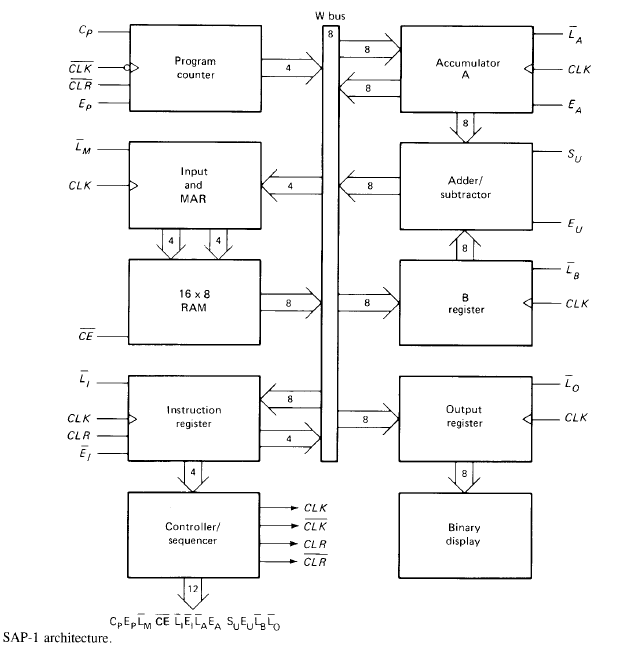

# Project Name: SAP-I-Verilog-Implementation
  The goal of this project is to implementa Simple-As-Possible Computer in verilog. Which can only perform addition and subtraction and no logical operation.
  
# Table of Contents:

- [Description](#description)
- [Components](#components)
- [Instruction Set](#instruction-set)

# Description
The Simple-As-Possible (SAP)-1 computer is a very basic model of a microprocessor which is a bus-organized computer and makes use of Von-Neumann architecture. It makes use of an 8-bit central bus and has ten main components. A pictorial representation of its architecture is shown below.

# Note:
In these files, I combined Designs and its testbench in the same file, but if you want to use it you have to separate them.
